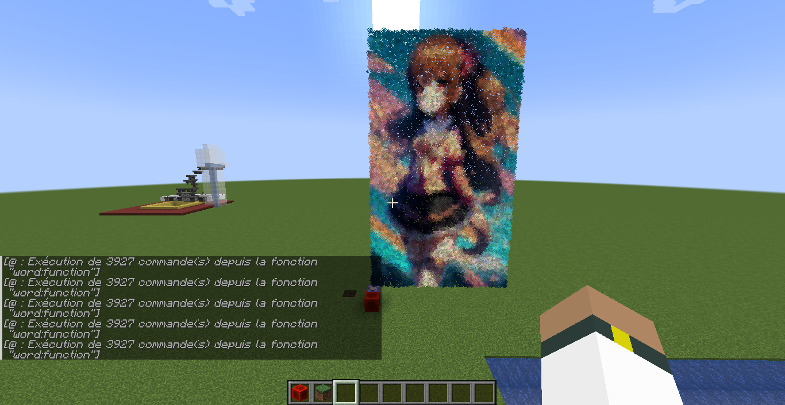
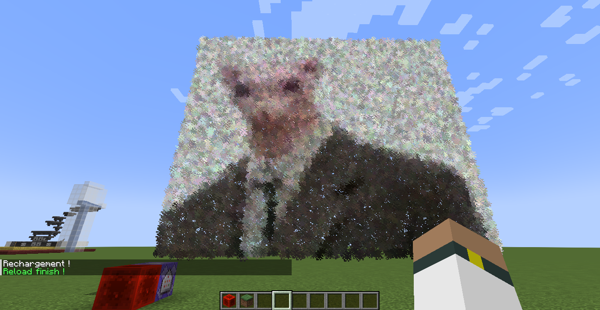
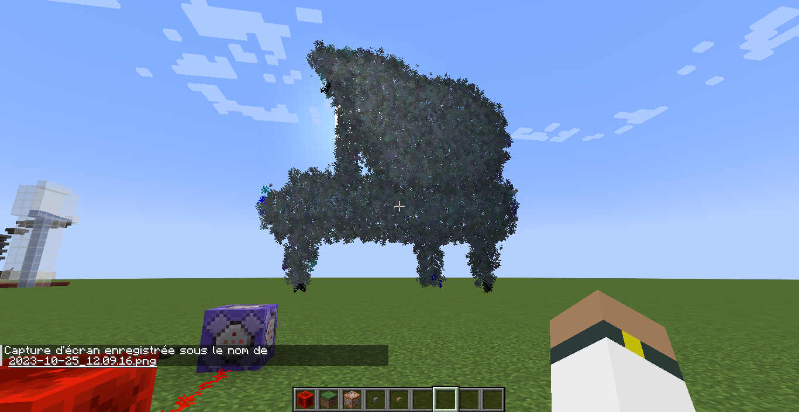
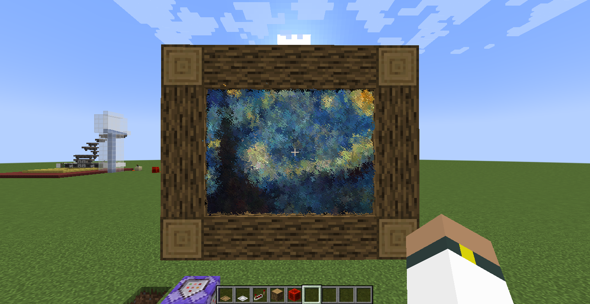
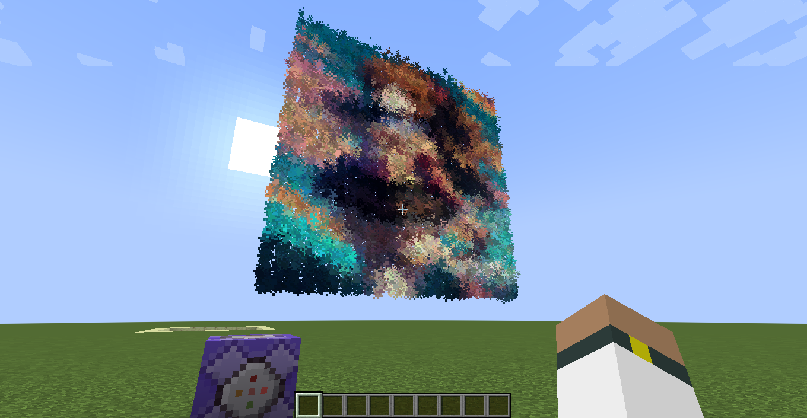
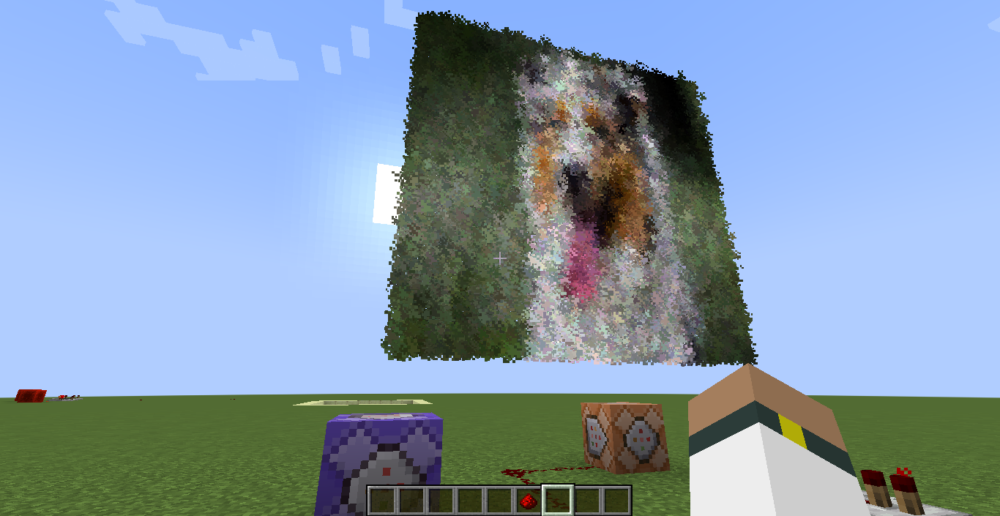
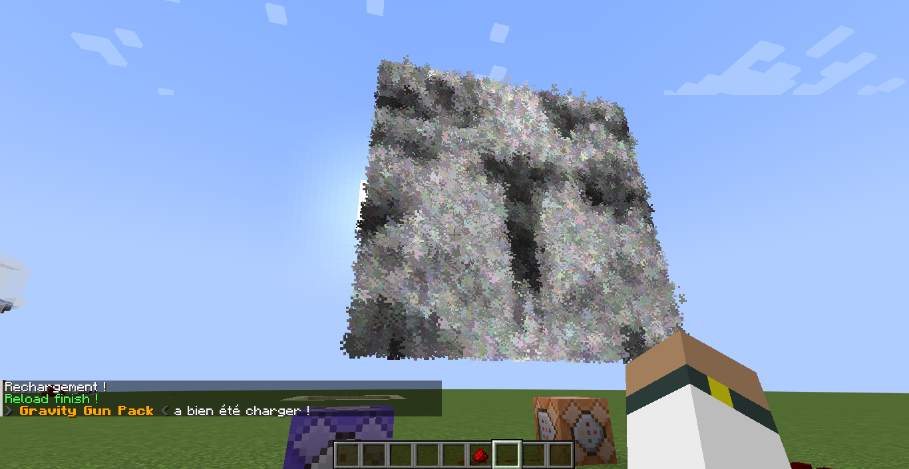
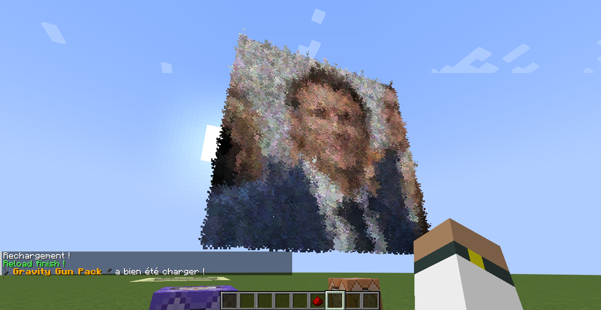

# img-to-mc
  **FR** : Ce programme a pour but de à partir d'une image la convertir en une fonction Minecraft (.mcfunction pour les Data-pack) permettant l'affichage d'image dans le jeu.
  
  **AN** : The purpose of this program is to convert an image into a Minecraft function (.mcfunction for Data-pack) enabling image display in the game.

#### Warning :
> **AN** : Using too large a quantity of particles can cause lags and a very significant loss of FPS
> One or more images that are too resource-intensive can prevent the world from loading when it opens.

#### Avertissements :
> **FR** : L'utilisation d'une trop grande quantité de particule peut anthrène des lags est perte de FPS très conséquente 
> Une ou des images trop gourmandes en ressource peuvent empêcher le chargement du monde à son élancement
  
*************************************

### Project progress :

| Step              | Statue           |
|-------------------|------------------|
| Prototy           | Finish           |
| Backend           | Finish           |
| Use command line  | Finish           |
| GUI               | Not started      |
| Vidéo ?           | Food for thought |

*************************************

### Addiction

> The project requires [Python 3.6.3](https://www.python.org/downloads/release/python-363/) !

| Packages                                                            | Version | Install command                                  |
|---------------------------------------------------------------------|---------|--------------------------------------------------|
| Pillow [ⓘ](https://pypi.org/project/Pillow/)                       | 8.4.0   | `python -m pip install Pillow==8.4.0`            |
| PyQt5 [ⓘ](https://pypi.org/project/PyQt5/)                         | 5.15.6  | `python -m pip install PyQt5==5.15.6`            |
| typing [ⓘ](https://pypi.org/project/typing/)                       | 3.7.4.3 | `python -m pip install typing==3.7.4.3`          |
| typing_extensions [ⓘ](https://pypi.org/project/typing-extensions/) | 4.1.1   | `python -m pip install typing_extensions==4.1.1` |

### Preview

> Screenshots of the in-game result.

View images to [folder](Github/)
